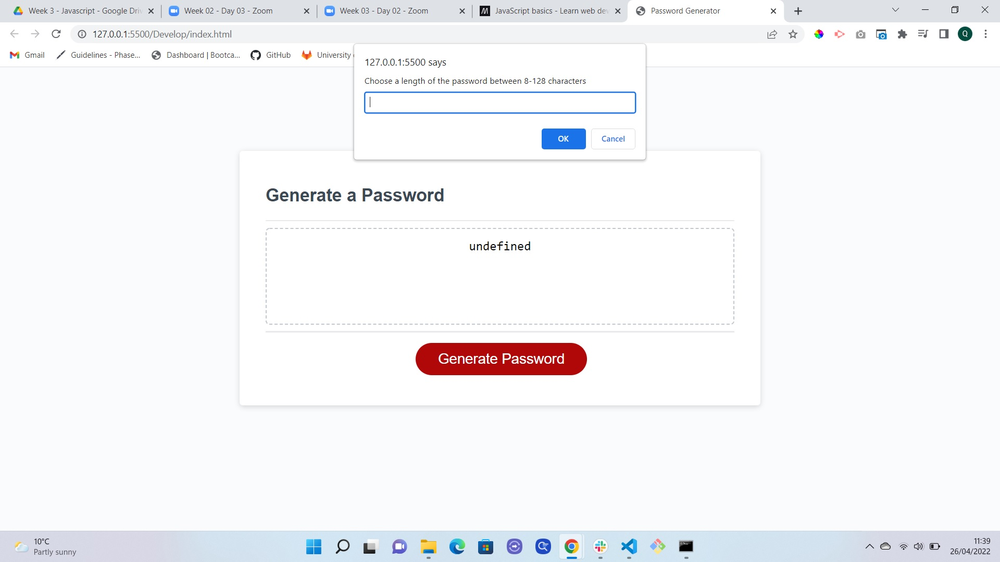
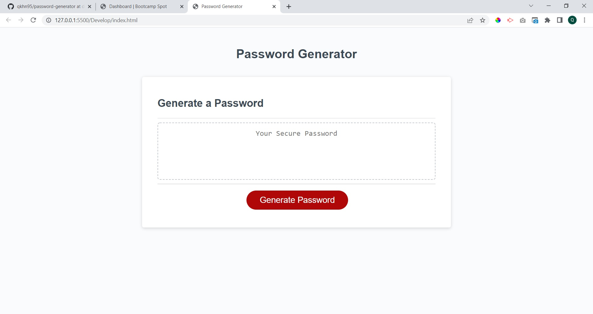

# password-generator

### 1 - Added the password criteria

Added the criteria for the password (uppercase, lowercase numbers and special characters)

### 2 - Added script for password length

As the requirements are for the password to be between 8-128 characters I have added the code for this to happen in the getPasswordLength const value

### 3 - Added script for password criteria

Added the script for the password criteria to give prompts for the different variables

### 4 - Added for loop

Added for loop, still having problem with code though

### 5 - Reverted Main Function of generator as this did not need to be changed

Had initially changed main code of generator however after getting advice this did not need to be changed

### 6 - Generator now fully operational

## Screenshots

## Technologies

- HTML
- Javascript
- Paint (for screenshots)
- Chrome Console
- MDN Docs
- W3Schools

## Github

https://github.com/qkhn95/password-generator/tree/dev

### Deployed Page

https://qkhn95.github.io/password-generator/

## Experience of this project

I found this project a bit troublesome to understand. Some of the concepts were pretty tough, and debugging and trying to understand why the generator was not working took a lot of time.
